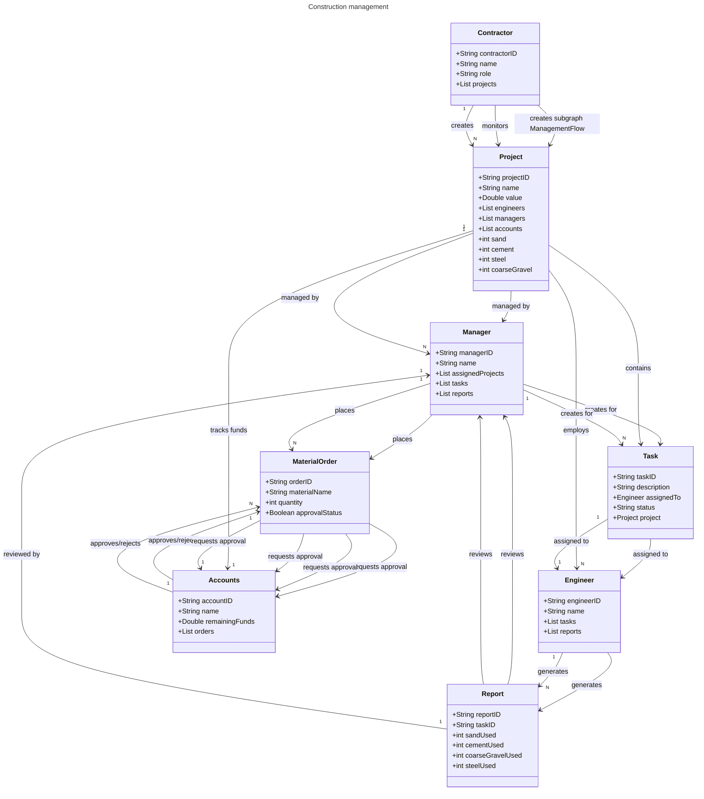

# Project Recording

https://northeastern-my.sharepoint.com/:v:/r/personal/karuthappandian_r_northeastern_edu/Documents/ConsoleLog%20(MARC)-%20Recording.mp4?csf=1&web=1&e=8oSZnu&nav=eyJyZWZlcnJhbEluZm8iOnsicmVmZXJyYWxBcHAiOiJTdHJlYW1XZWJBcHAiLCJyZWZlcnJhbFZpZXciOiJTaGFyZURpYWxvZy1MaW5rIiwicmVmZXJyYWxBcHBQbGF0Zm9ybSI6IldlYiIsInJlZmVycmFsTW9kZSI6InZpZXcifX0%3D

# MARC - Building Smarter, Managing Better

MARC is a comprehensive web-based platform designed to streamline and enhance the workflow in the building construction industry. By providing a centralized system for tracking and analyzing all construction activities, MARC reduces the workload and administrative burden on contractors, improves communication between key entities, and ensures a well-organized process flow

## Table of Contents

- [**MARC - Building Smarter, Managing Better**](#marc---building-smarter-managing-better)

- [**Project Overview**](#project-overview)

- [**Features**](#features)

- [**Tech**](#technology-stack)

- [**Getting Started**](#getting-started)

- [**Project Structure**](#project-structure)

- [**License**](#license)

- [**Contact**](#contact)

## Main Entities

The MARC platform is built around three key user entities, each with specific roles and responsibilities:

1. Contractor

   - Role: The company owner or manager overseeing the entire construction project.

   - Responsibilities: Monitors all activities within the construction workflow, approves key decisions, and ensures the project stays on schedule.

   - Key Features: Access to dashboard summaries, progress reports, approval mechanisms, and high-level insights into project health.

2. Accounts

   - Role: Manages financials and oversees fund distribution and approvals.

   - Responsibilities: Monitors budgets, reviews expenditure reports, and approves material and order requests from the procurement team.

   - Key Features: Financial tracking, fund allocation, expenditure approval workflows, and budget management tools.

3. Procurement

   - Role: Responsible for executing the project and handling materials and resources required for construction.

   - Responsibilities: Initiates requests for orders and materials, tracks deliveries, and manages vendor relationships.

   - Key Features: Material order requests, vendor management, delivery tracking, and procurement status updates.

## Features

- Real-time Project Tracking: Visual dashboards and reports for contractors to monitor the project's status.

- Workflow Automation: Streamlines communication and approval processes between accounts and procurement teams.

- Financial Management: Provides accounts with tools to manage budgets, approve funding, and monitor expenditures.

- Material Request System: Facilitates procurement's ability to request and track materials seamlessly.

- User-Friendly Interface: Ensures ease of use for all types of users, from contractors to procurement specialists.

- Fugu Capabilities: Allows for seamless integration with Fugu, enhancing the user experience and efficiency.

- MapBox API Integration: Offers a visual representation of the project's location and progress on a map.

- React chart .js Integration: Provides interactive and dynamic charts for data visualization.

## Technology Stack

The Hoist project leverages a robust stack of modern technologies to ensure a seamless and efficient user experience:

- Front-End: React.js, SCSS, Redux
- Back-End: Node.js, Express.js
- Database: MongoDB
- State Management: Redux
- Styling: SCSS for dynamic and responsive design

## Getting Started

This project consists of two main components: a frontend (marc-frontend) and a backend (marc-backend). Follow the instructions below to set up and run the project locally.

### 1. Clone the Repository

```bash
git clone https://github.com/info-6150-fall-2024/final-project-consolelog.git
cd final-project-consolelog
```

### 2. Install Dependencies

#### Backend (marc-backend)

1. Navigate to the marc-backend directory:

   ```bash
   cd marc-backend
   ```

2. Install the dependencies:
   ```bash
   npm install
   ```

#### Frontend (marc-frontend)

1. Navigate to the marc-frontend directory:

   ```bash
   cd marc-frontend
   ```

2. Install the dependencies:
   ```bash
   npm install
   ```

### 3. Set Up MongoDB

Before running the application, you need to set up the database:

- Ensure MongoDB is running locally or connect to a cloud-based MongoDB instance
- Update the database connection string in the `.env` file located in the marc-backend folder
- Make sure your MongoDB connection is properly configured and accessible

### 4. Start the Development Servers

#### Start the Backend Server

1. Navigate to the backend directory:
   ```bash
   cd marc-backend
   npm run dev
   ```

#### Start the Frontend Server

1. Navigate to the frontend directory:
   ```bash
   cd marc-frontend
   npm run dev
   ```

The application should now be running locally. You can access the frontend through your web browser and the backend will be available for API requests.

## Project Structure



## License

This project is licensed under the [Northeastern University](https://graduate.northeastern.edu/program/master-of-science-in-software-engineering-systems-18774/).

## Contact

For any inquiries or futher information, feel free to contact through email:  

Author

- [Jayanth Mani](mani.j@northeastern.edu)

